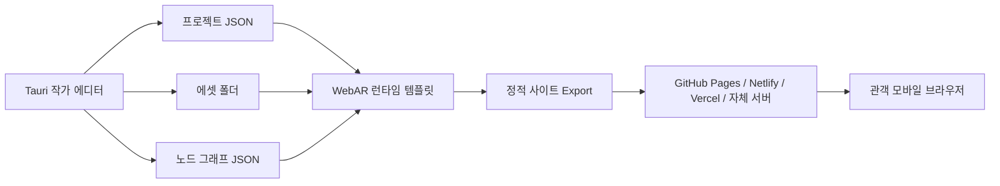

# 오픈소스 WebAR 에디터 제작 단계

확인일: 2026-04-24

## 목표

미디어아트 작가들이 Three.js, MindAR, AR.js 같은 오픈소스 WebAR 기술을 직접 깊게 다루지 않아도, 이미지/작품 표면/포스터/전시 캡션을 타깃으로 삼아 AR 작업을 만들고 웹으로 배포할 수 있는 제작 에디터를 설계한다.

핵심 방향은 다음과 같다.

- 완전한 플랫폼 종속을 피한다.
- 프로젝트 파일, 에셋, 설정 JSON, 빌드 결과물을 작가가 소유한다.
- 최종 결과물은 정적 웹사이트로 export되어 GitHub Pages, Netlify, Vercel, 개인 서버에 올릴 수 있다.
- 1차 목표는 “마커리스 공간 AR”이 아니라 “작품 안에 설계된 타깃 기반 WebAR”이다.
- 작가가 타깃 이미지를 작품 언어 안에 자연스럽게 통합할 수 있도록 한다.

## 가능한 수준

이 에디터로 우선 가능하게 만들 수 있는 작업:

- 포스터, 사진, 책 표지, 전시 캡션, 오브젝트 라벨을 인식해 3D/이미지/영상/사운드를 띄우기
- 작품의 평평한 표면 또는 시각적 패턴을 타깃으로 삼기
- 관객 얼굴 위에 마스크, 이미지, 3D 오브젝트, 텍스트, 파티클을 얹기
- AR 장면 안에서 터치, 클릭, 사운드 재생, 애니메이션 시작 같은 기본 인터랙션 만들기
- QR 또는 짧은 URL로 모바일 브라우저에서 접속하기
- 정적 웹사이트로 내보내 장기 보존하기

어려운 작업:

- 아무 기준점 없이 바닥/벽을 자동 인식하는 8th Wall 수준의 마커리스 공간 AR
- 관객이 작품 주변을 크게 이동해도 3D 오브젝트가 실제 공간에 완벽히 고정되는 경험
- 복잡한 3D 물체 자체를 여러 각도에서 안정적으로 인식하는 object tracking
- 손 추적, VPS, 정밀 실내 위치 기반 AR
- iOS Safari와 Android Chrome에서 완전히 동일한 월드 트래킹 품질 제공

따라서 첫 버전은 **이미지 타깃 기반 WebAR 에디터**로 시작하는 것이 가장 현실적이다.

## 기술 스택

| 영역 | 추천 기술 | 역할 |
|---|---|---|
| 데스크톱 앱 | Tauri | 로컬 파일 접근, export, preview server, 가벼운 패키징 |
| 에디터 UI | React + Vite | 빠른 웹앱 개발 |
| 노드 에디터 | React Flow | 조건-동작 기반 Visual Scripting |
| 3D 렌더링 | Three.js 또는 React Three Fiber | 편집 화면과 AR 장면 렌더링 |
| 이미지 타깃 AR | MindAR | 포스터/사진/캡션/라벨 기반 AR |
| 얼굴 AR | MindAR Face Tracking | 얼굴 기반 작업 |
| 마커/GPS AR | AR.js | 마커 또는 위치 기반 실험 |
| 상태 저장 | JSON | 프로젝트 구조 저장 |
| 파일 저장 | Tauri 파일 시스템 API | 로컬 프로젝트 폴더 열기/저장 |
| 빌드/export | Vite build + 정적 템플릿 생성 | 배포 가능한 HTML 생성 |
| 배포 | GitHub Pages / Netlify / Vercel / 개인 서버 | 장기 보존 가능한 웹 배포 |

## 앱 설계 원칙

에디터는 **Tauri 기반 데스크톱 앱**으로 만들고, 최종 결과물은 **Tauri와 무관한 정적 WebAR 사이트**로 export한다.

이 구분이 중요하다. 에디터 앱이 사라져도 작품은 `index.html`, `config.json`, `assets/`, `runtime/`만으로 계속 보존되고 실행될 수 있어야 한다.

```txt
Tauri Editor
  - 프로젝트 열기/저장
  - 에셋 관리
  - 3D 배치
  - 노드 기반 인터랙션 설계
  - 모바일 QR 미리보기
  - 정적 웹사이트 export

Exported WebAR Site
  - Tauri 필요 없음
  - 앱 설치 필요 없음
  - 정적 호스팅 가능
  - 모바일 브라우저에서 실행
```

Tauri를 사용하는 이유:

- 작가가 로컬 폴더 단위로 프로젝트를 소유할 수 있다.
- 인터넷이 불안정한 워크숍 환경에서도 편집을 계속할 수 있다.
- 에셋 복사, ZIP export, README 생성, 로컬 preview server 실행을 안정적으로 처리할 수 있다.
- Electron보다 가볍고, 데스크톱 앱 패키징에 유리하다.
- 브라우저 기반 File System Access API보다 교육 환경의 OS 차이를 줄일 수 있다.

주의할 점:

- AR 테스트는 Tauri WebView 안에서 끝내면 안 된다.
- 최종 검증은 반드시 iPhone Safari와 Android Chrome에서 해야 한다.
- 카메라 권한, HTTPS, 영상/사운드 자동재생 정책은 실제 모바일 브라우저 기준으로 확인해야 한다.
- Tauri는 에디터의 껍데기일 뿐, 작품 런타임은 순수 웹 기술로 유지해야 한다.

## 전체 구조



## 에디터 내부 구조

```txt
tauri-webar-editor/
  src-tauri/
    src/
      main.rs
      commands/
        project.rs
        export.rs
        preview.rs
        assets.rs
  src/
    app/
      App.tsx
    editor/
      viewport/
      node-graph/
      asset-panel/
      inspector/
      timeline/
    runtime-template/
      index.html
      ar-scene-loader.ts
      mindar-image-runtime.ts
      mindar-face-runtime.ts
    shared/
      project-schema.ts
      graph-schema.ts
      asset-schema.ts
```

Tauri backend 역할:

- 프로젝트 폴더 생성
- 프로젝트 열기/저장
- 에셋 복사와 경로 정리
- export 폴더 생성
- ZIP 패키징
- 로컬 preview server 실행
- 모바일 접속용 QR URL 생성
- README/라이선스/설치 가이드 자동 생성

React frontend 역할:

- 작가용 UI
- 3D 뷰포트
- 노드 그래프
- 에셋 패널
- 속성 패널
- 템플릿 선택
- 모바일 미리보기 상태 표시

## 프로젝트 파일 구조

에디터가 export하는 결과물은 가능한 단순해야 한다.

```txt
project-name/
  index.html
  config.json
  manifest.json
  assets/
    targets/
      target.mind
      target-preview.jpg
    models/
      object.glb
    images/
      overlay.png
    videos/
      video.mp4
    audio/
      sound.mp3
  runtime/
    mindar-image.js
    mindar-face.js
    three-runtime.js
    ar-scene-loader.js
  README.md
```

중요한 원칙:

- 프로젝트는 폴더 하나로 보존 가능해야 한다.
- `config.json`만 읽으면 장면을 복원할 수 있어야 한다.
- 런타임은 특정 서버 없이 정적 파일로 작동해야 한다.
- CDN 의존은 선택으로 두고, 장기 보존용 export에는 필요한 런타임 파일을 함께 포함한다.

## 편집용 프로젝트 구조

에디터 내부의 원본 프로젝트는 export 결과물보다 정보를 더 많이 가진다.

```txt
my-ar-project/
  project.webar.json
  graph.webar.json
  assets/
    source/
    optimized/
    targets/
    models/
    images/
    videos/
    audio/
  exports/
    2026-04-24-web/
  documentation/
    artist-note.md
    installation-guide.md
    test-checklist.md
```

`project.webar.json`은 장면과 에셋 정보를 저장하고, `graph.webar.json`은 노드 기반 인터랙션을 저장한다.

## config.json 예시

```json
{
  "version": "0.1.0",
  "tracking": {
    "type": "image",
    "target": "assets/targets/target.mind",
    "preview": "assets/targets/target-preview.jpg"
  },
  "scene": {
    "background": "camera",
    "units": "meters",
    "objects": [
      {
        "id": "model-001",
        "type": "model",
        "src": "assets/models/object.glb",
        "position": [0, 0, 0],
        "rotation": [0, 0, 0],
        "scale": [1, 1, 1],
        "visible": true,
        "events": [
          {
            "trigger": "tap",
            "action": "playAnimation",
            "target": "model-001",
            "animation": "Take 001"
          }
        ]
      }
    ]
  }
}
```

## 노드 기반 설계

전체 에디터를 전부 노드로 만들 필요는 없다. 작가가 실제로 편하게 쓰려면 역할을 나누는 것이 좋다.

| 영역 | 추천 방식 |
|---|---|
| 타깃 이미지 업로드 | 마법사/폼 방식 |
| 3D 모델 위치/크기/회전 | 직접 조작하는 3D 뷰포트 |
| 이미지/영상/사운드 배치 | 에셋 패널 + 뷰포트 |
| 상호작용과 조건 | 노드 그래프 |
| 저장 | `project.webar.json` + `graph.webar.json` |
| 배포 | 정적 사이트 export |

노드 그래프는 “언제 무엇이 일어나는가”를 설계하는 영역이다.

예시:

```txt
[타깃 인식됨] -> [3D 모델 보이기] -> [애니메이션 재생] -> [사운드 재생]
```

```txt
[오브젝트 터치] -> [영상 재생] -> [다음 텍스트 표시]
```

### 초기 노드 종류

입력 노드:

- 타깃 인식됨
- 타깃 사라짐
- 오브젝트 터치
- 버튼 클릭
- 시간 경과
- 영상 끝남
- 사운드 끝남

동작 노드:

- 보이기
- 숨기기
- 토글
- 사운드 재생
- 사운드 정지
- 영상 재생
- 영상 일시정지
- 애니메이션 재생
- 위치 이동
- 크기 변경
- 색 변경
- URL 열기
- 장면 전환

데이터 노드:

- 숫자
- 텍스트
- 색상
- 시간
- 랜덤값
- 관객 입력값

출력 노드:

- 3D 모델
- 이미지
- 비디오
- 오디오
- 텍스트
- 버튼

### graph.webar.json 예시

```json
{
  "version": "0.1.0",
  "nodes": [
    {
      "id": "target-found-001",
      "type": "event.targetFound",
      "label": "타깃 인식됨"
    },
    {
      "id": "show-model-001",
      "type": "action.show",
      "label": "3D 모델 보이기",
      "target": "model-001"
    },
    {
      "id": "play-sound-001",
      "type": "action.playSound",
      "label": "사운드 재생",
      "src": "assets/audio/sound.mp3"
    }
  ],
  "edges": [
    {
      "from": "target-found-001",
      "to": "show-model-001"
    },
    {
      "from": "show-model-001",
      "to": "play-sound-001"
    }
  ]
}
```

중요한 원칙:

- 노드는 JavaScript 코드를 직접 생성하지 않는다.
- 노드는 안정적인 JSON으로 저장된다.
- WebAR 런타임은 JSON을 해석해서 실행한다.
- 이렇게 해야 에디터가 사라져도 작품을 복원할 수 있다.

## Signal Binding 설계

이 에디터는 단순히 “클릭하면 실행되는 이벤트 노드”에 머물면 안 된다. 미디어아트 작가에게 더 중요한 것은 오디오, 얼굴, 시간, 센서 같은 실시간 데이터를 AR 오브젝트의 속성에 연결하는 방식이다.

따라서 TouchDesigner의 CHOP Reference 개념을 참고해 **Signal Binding** 시스템을 핵심 설계 원칙으로 둔다.

기본 아이디어:

```txt
audio.low  -> foreheadObject.scale
audio.mid  -> foreheadObject.rotationY
audio.high -> foreheadObject.material.emissiveIntensity
face.yaw   -> particleSystem.spread
time.sin   -> text.opacity
```

이 방식은 작가가 코드를 쓰지 않고도 “데이터로 움직이는 AR”을 만들 수 있게 한다.

### Event Graph와 Signal Graph 분리

노드 시스템은 두 층으로 나눈다.

| 그래프 | 역할 | 예시 |
|---|---|---|
| Event Graph | 특정 사건이 발생했을 때 한 번 실행 | 타깃 인식됨, 오브젝트 터치, 영상 끝남, 장면 전환 |
| Signal Graph | 매 프레임 변하는 값을 속성에 연결 | 오디오 볼륨, 주파수, 얼굴 회전, 시간, 랜덤 |

Event Graph 예시:

```txt
[타깃 인식됨] -> [영상 재생] -> [사운드 재생]
```

Signal Graph 예시:

```txt
[Audio Analyzer.low] -> [Map 0..1 to 0.8..2.5] -> [foreheadObject.scale]
```

```txt
[Face Tracking.yaw] -> [Smooth 0.2] -> [particleSystem.spread]
```

이 구분이 중요하다. 오디오비주얼, 퍼포먼스, 얼굴 반응형 작업은 대부분 Event Graph보다 Signal Graph가 더 중요하다.

### TouchDesigner 개념 대응

| TouchDesigner 개념 | 이 에디터에서의 대응 |
|---|---|
| CHOP channel | 실시간 데이터 채널 |
| CHOP Reference | 오브젝트 속성에 데이터 채널 바인딩 |
| Export CHOP | 채널 값을 속성에 직접 연결 |
| Math CHOP | 값 범위 변환, clamp, normalize |
| Filter/Lag CHOP | smooth, easing, damping |
| Select CHOP | 필요한 채널만 선택 |
| Null CHOP | 안정적인 최종 출력 채널 |
| DAT/parameter reference | JSON 기반 속성 바인딩 |

### 초기 Signal Source

오디오:

- `audio.volume`
- `audio.low`
- `audio.mid`
- `audio.high`
- `audio.peak`
- `audio.beat`
- `audio.spectrum[0..n]`

얼굴:

- `face.x`
- `face.y`
- `face.z`
- `face.pitch`
- `face.yaw`
- `face.roll`
- `face.mouthOpen`
- `face.leftEye`
- `face.rightEye`
- `face.foreheadAnchor`

시간:

- `time.seconds`
- `time.delta`
- `time.sin`
- `time.cos`
- `time.loop`

랜덤/노이즈:

- `random.value`
- `random.noise`
- `random.pulse`

타깃:

- `target.visible`
- `target.confidence`
- `target.x`
- `target.y`
- `target.rotation`

### 초기 Signal Modifier

- Map
- Clamp
- Normalize
- Smooth
- Lag
- Invert
- Multiply
- Add
- Threshold
- Pulse
- Hold
- Ease

첫 버전에서 수학 노드를 너무 많이 열어두면 작가가 어렵게 느낄 수 있다. 우선은 `Map`, `Clamp`, `Smooth`, `Threshold`만 제공해도 충분하다.

### 연결 가능한 속성

Transform:

- `position.x`
- `position.y`
- `position.z`
- `rotation.x`
- `rotation.y`
- `rotation.z`
- `scale`
- `scale.x`
- `scale.y`
- `scale.z`

Material:

- `opacity`
- `color`
- `emissiveIntensity`
- `roughness`
- `metalness`

Media:

- `video.playbackRate`
- `video.opacity`
- `audio.volume`

Animation:

- `animation.speed`
- `animation.weight`
- `animation.time`

Particle:

- `particle.rate`
- `particle.size`
- `particle.spread`
- `particle.speed`

### Signal Binding JSON 예시

```json
{
  "version": "0.1.0",
  "bindings": [
    {
      "id": "binding-001",
      "source": "audio.low",
      "target": "objects.forehead-crown.scale",
      "map": {
        "in": [0, 1],
        "out": [0.8, 2.5],
        "clamp": true,
        "smooth": 0.15
      }
    },
    {
      "id": "binding-002",
      "source": "audio.high",
      "target": "objects.forehead-crown.material.emissiveIntensity",
      "map": {
        "in": [0, 1],
        "out": [0.2, 4.0],
        "clamp": true,
        "smooth": 0.05
      }
    },
    {
      "id": "binding-003",
      "source": "face.yaw",
      "target": "objects.forehead-particles.rotation.y",
      "map": {
        "in": [-1, 1],
        "out": [-0.5, 0.5],
        "clamp": true,
        "smooth": 0.2
      }
    }
  ]
}
```

### 작가용 UI 표현

Signal Binding을 기술 용어로 노출하면 어렵다. UI에서는 다음처럼 표현한다.

| 기술 표현 | 작가용 표현 |
|---|---|
| audio.low | 음악의 낮은 소리 |
| audio.mid | 음악의 중간 소리 |
| audio.high | 음악의 높은 소리 |
| face.yaw | 고개를 좌우로 돌림 |
| face.pitch | 고개를 위아래로 움직임 |
| signal binding | 값 연결 |
| map range | 반응 범위 |
| smooth | 부드럽게 |
| threshold | 이 값보다 클 때 |
| clamp | 범위 밖으로 안 나가게 |

예시 UI 문장:

```txt
음악의 낮은 소리가 커질수록
이마 오브젝트의 크기가
0.8에서 2.5까지 커진다.
부드럽게: 15%
```

### 오디오 반응형 얼굴 AR 예시

작품 예시:

> 관객의 얼굴을 인식하고, 이마 위에 떠 있는 3D 오브젝트가 음악의 저음/중음/고음에 따라 크기, 회전, 빛, 파티클을 변화시킨다.

구조:

```txt
[마이크 입력 또는 오디오 파일]
        ↓
[Web Audio API 분석]
        ↓
[audio.low / audio.mid / audio.high / audio.beat]
        ↓
[Signal Binding]
        ↓
[Face Tracking foreheadAnchor에 붙은 3D 오브젝트]
```

노드/바인딩 예시:

```txt
audio.low  -> Map 0..1 to 0.8..2.5 -> foreheadObject.scale
audio.mid  -> Smooth 0.2 -> foreheadObject.rotationSpeed
audio.high -> Threshold 0.75 -> particleBurst.trigger
audio.beat -> foreheadObject.animationSpeed
```

필요 기능:

- 마이크 권한 요청
- 오디오 파일 업로드와 재생
- Web Audio API `AnalyserNode`
- FFT 기반 주파수 대역 분석
- 저음/중음/고음 분리
- 간단한 beat/peak detection
- MindAR Face Tracking
- 얼굴 landmark 기반 이마 anchor 계산
- Three.js 오브젝트 속성 실시간 업데이트

주의점:

- iOS에서는 사운드/마이크 사용 전에 사용자 터치가 필요하다.
- 마이크 입력은 개인정보 안내가 필요하다.
- 얼굴 데이터는 저장하지 않는 것을 기본으로 한다.
- 얼굴 트래킹, 오디오 분석, 3D 렌더링을 동시에 수행하므로 모바일 성능 제한을 둔다.
- 고급 beat detection은 1차 버전에서 단순 peak detection으로 시작한다.

## Effect House에서 차용할 설계 방향

Effect House의 장점은 “비개발자가 빠르게 결과물을 만들 수 있는 제작 UX”에 있다. 이 방향은 적극적으로 차용하되, TikTok 플랫폼 문법은 따르지 않는다.

차용할 요소:

| Effect House식 설계 | 이 에디터에 적용 |
|---|---|
| 템플릿 중심 시작 | 포스터 AR, 캡션 AR, 얼굴 AR, 사운드워크 템플릿 |
| Visual Scripting | 조건-동작 노드 그래프 |
| 에셋 패널 | 이미지, GLB, 영상, 사운드 라이브러리 |
| 실시간 프리뷰 | 데스크톱 프리뷰 + 모바일 QR 테스트 |
| 쉬운 퍼블리싱 | TikTok 제출 대신 정적 웹사이트 ZIP export |
| AI Editor / Create With AI | 선택 기능: 타깃 품질 분석, 에셋 최적화, README 초안 생성 |
| Creator guides | 작가용 튜토리얼과 실패 사례 중심 가이드 |

차용하지 않을 요소:

- TikTok 피드/라이브/스티커 중심 결과물 문법
- 바이럴/챌린지/브랜드 협업 중심 설계
- 계정, 심사, 플랫폼 제출 의존
- 짧고 즉각적인 필터 효과에 치우친 UX
- 장기 보존보다 확산을 우선하는 구조

이 에디터의 철학은 Effect House와 반대 방향이어야 한다.

> Effect House는 플랫폼 안에서 빠르게 확산되는 효과를 만들게 한다. 이 에디터는 작가가 자기 파일을 소유하고, 웹에 배포하고, 장기 보존할 수 있는 AR 작품을 만들게 해야 한다.

## 제작 단계

### 0단계: 범위 확정

먼저 “가능한 AR”과 “하지 않을 AR”을 명확히 나눈다.

1차 범위:

- 이미지 타깃 기반 AR
- 3D 모델 배치
- 이미지/비디오/오디오 배치
- 기본 인터랙션
- 모바일 미리보기
- 정적 사이트 export

1차에서 제외:

- 바닥/벽 자동 인식
- 정밀 VPS
- 3D object tracking
- 협업 편집
- 클라우드 호스팅
- 계정 시스템
- 결제/사용량 관리

이렇게 해야 에디터가 “플랫폼”이 아니라 “작가용 로컬 제작 도구”로 시작할 수 있다.

### 1단계: 최소 런타임 만들기

에디터보다 먼저, export된 결과물이 실제 모바일에서 돌아가는지 확인해야 한다.

필수 기능:

- MindAR 이미지 타깃 로드
- 카메라 권한 요청
- 타깃 인식 시 Three.js 장면 표시
- GLB 모델 표시
- 이미지/영상 plane 표시
- 사운드 재생
- 터치 이벤트 처리

검증 기준:

- iPhone Safari에서 실행
- Android Chrome에서 실행
- HTTPS 환경에서 실행
- 타깃을 잃었을 때 오브젝트가 사라지거나 정지
- 다시 타깃을 잡으면 장면 복원

이 단계의 산출물:

```txt
runtime-prototype/
  index.html
  config.json
  assets/
  runtime/
```

### 1.5단계: Tauri 앱 껍데기 만들기

최소 런타임이 모바일에서 검증된 뒤, Tauri 기반 에디터 앱을 만든다.

필수 기능:

- 새 프로젝트 만들기
- 프로젝트 폴더 열기
- `project.webar.json` 저장
- 에셋을 프로젝트 폴더로 복사
- export 폴더 생성
- 로컬 preview server 실행
- QR 코드 표시

이 단계에서는 아직 노드 그래프나 3D 편집기가 완성될 필요는 없다. 중요한 것은 “로컬 파일 기반 프로젝트”와 “모바일 미리보기” 흐름을 먼저 확보하는 것이다.

### 2단계: 타깃 생성 워크플로우

작가가 포스터, 사진, 캡션, 라벨 이미지를 업로드하면 MindAR용 target 파일을 만들어야 한다.

필수 기능:

- 타깃 이미지 업로드
- 이미지 품질 검사
- MindAR target compile
- `target.mind` 생성
- target preview 저장
- 좋은 타깃/나쁜 타깃 피드백 표시

좋은 타깃 조건:

- 디테일이 많다.
- 대비가 분명하다.
- 반복 패턴이 적다.
- 반사가 적다.
- 평평하게 설치할 수 있다.
- 관객이 가까이 비출 수 있다.

나쁜 타깃 조건:

- 흰색 여백이 많다.
- 단색 면이 많다.
- 반복 패턴뿐이다.
- 유리/금속 반사가 강하다.
- 조명에 따라 모습이 크게 바뀐다.
- 너무 작거나 너무 멀리 설치된다.

이 단계에서 “QR 마커”가 아니라 “작품 표면을 타깃으로 설계하는 법”을 교육 콘텐츠로 함께 만들어야 한다.

### 3단계: 장면 편집기

작가가 코드를 보지 않고 장면을 만들 수 있게 한다.

필수 UI:

- 타깃 이미지 미리보기
- 3D 모델 업로드
- 이미지/비디오/오디오 업로드
- 위치 조정
- 회전 조정
- 크기 조정
- 보이기/숨기기
- 레이어 순서
- 모바일 프레임 미리보기

작가 친화적 표현:

- `x, y, z` 대신 “좌우 / 위아래 / 앞뒤”
- `scale` 대신 “크기”
- `rotation` 대신 “기울기”
- `anchor` 대신 “붙는 기준”
- `target` 대신 “인식할 이미지”

고급 패널은 숨겨도 된다.

- 좌표값 직접 입력
- GLB 애니메이션 이름
- material 설정
- 렌더링 옵션
- 디버그 로그

### 4단계: 노드 기반 인터랙션 시스템

첫 버전의 노드 그래프는 복잡한 visual programming이 아니라 “조건-동작” 방식이 좋다.

예시:

| 조건 | 동작 |
|---|---|
| 타깃을 인식하면 | 오브젝트 보이기 |
| 타깃을 잃으면 | 영상 일시정지 |
| 오브젝트를 터치하면 | 사운드 재생 |
| 버튼을 누르면 | 다음 장면으로 이동 |
| 시간이 지나면 | 텍스트 표시 |
| 영상이 끝나면 | 다른 오브젝트 보이기 |

JSON 구조:

```json
{
  "trigger": "tap",
  "target": "object-001",
  "action": "playSound",
  "src": "assets/audio/sound.mp3"
}
```

1차 인터랙션:

- show
- hide
- toggle
- playSound
- pauseSound
- playVideo
- pauseVideo
- playAnimation
- openURL
- changeScene

구현 방식:

- React Flow로 노드 UI를 만든다.
- 노드 종류는 제한한다.
- 노드 연결은 순차 실행을 기본으로 한다.
- 조건 분기, 반복, 변수, 수학 노드는 1차 버전에서 제외한다.
- 그래프는 `graph.webar.json`으로 저장한다.
- 런타임은 그래프를 순회하면서 등록된 액션을 실행한다.

초기에는 자유로운 노드 그래프보다 “작가가 실수하기 어려운 노드”가 중요하다.

### 4.5단계: Signal Binding 시스템

노드 기반 인터랙션이 안정화되면, TouchDesigner의 CHOP Reference와 유사한 Signal Binding 시스템을 추가한다.

필수 기능:

- 실시간 데이터 채널 목록 표시
- 오브젝트 속성 목록 표시
- 채널을 속성에 드래그해서 연결
- 입력 범위/출력 범위 설정
- clamp 옵션
- smooth 옵션
- 연결 상태 미리보기
- 값 변화 그래프 표시

초기 데이터 채널:

- `audio.volume`
- `audio.low`
- `audio.mid`
- `audio.high`
- `face.x`
- `face.y`
- `face.yaw`
- `face.pitch`
- `time.sin`
- `random.noise`

초기 연결 속성:

- `scale`
- `position`
- `rotation`
- `opacity`
- `emissiveIntensity`
- `animationSpeed`
- `particleRate`

성공 기준:

- 작가가 코드를 쓰지 않고 오디오 볼륨을 3D 오브젝트 크기에 연결할 수 있다.
- 얼굴 회전값을 파티클 방향이나 오브젝트 회전에 연결할 수 있다.
- 바인딩 정보가 `bindings.webar.json`으로 저장되고 export 결과물에서 실행된다.

### 5단계: 모바일 미리보기

작가 교육에서 가장 중요한 기능이다. 에디터 안에서 잘 보여도 휴대폰에서 망가지면 쓸 수 없다.

필수 기능:

- 로컬 dev server 실행
- QR 코드 생성
- 같은 Wi-Fi에서 모바일 접속
- HTTPS 또는 터널링 옵션
- 모바일 콘솔 로그 보기
- 카메라 권한 에러 안내

Tauri 앱에서 처리할 기능:

- preview server 시작/중지
- 현재 PC의 local network IP 감지
- preview URL 생성
- QR 코드 표시
- export 전 임시 빌드 생성
- 모바일 접속 상태 표시

검증 항목:

- 카메라 권한 요청이 뜨는가
- 타깃 인식이 되는가
- GLB가 너무 무겁지 않은가
- 영상 자동재생 정책에 걸리지 않는가
- 사운드는 사용자 터치 후 재생되는가
- iOS와 Android에서 위치/크기가 크게 다르지 않은가

### 6단계: 정적 사이트 export

작가가 결과물을 자기 소유로 보존할 수 있게 하는 핵심 단계다.

Export 버튼을 누르면:

- `index.html` 생성
- `config.json` 생성
- 필요한 runtime 파일 복사
- assets 폴더 복사
- README 생성
- 배포 가이드 생성
- ZIP 다운로드

README에는 다음을 자동 생성한다.

- 작품 제목
- 사용한 타깃 이미지
- 필요한 브라우저 조건
- 권장 관람 거리
- 배포 방법
- 라이선스 정보
- 작가 노트

배포 가이드:

- GitHub Pages
- Netlify Drop
- Vercel
- 개인 서버
- 학교/기관 서버

Export 원칙:

- export 결과물은 Tauri 없이 실행되어야 한다.
- export 결과물은 계정 로그인 없이 실행되어야 한다.
- 가능하면 CDN 없이 실행되는 옵션을 제공한다.
- 사용한 라이브러리 버전을 README에 기록한다.
- `project.webar.json`과 `graph.webar.json`도 함께 포함해 복원 가능성을 높인다.

### 7단계: 얼굴 AR 템플릿 추가

이미지 타깃 기반이 안정화된 후 Face Tracking을 추가한다.

가능한 템플릿:

- 얼굴 마스크
- 얼굴 주변 파티클
- 눈/입 위치 기반 이미지
- 얼굴 움직임에 반응하는 사운드
- 초상/정체성/퍼포먼스 작업 템플릿
- 오디오 반응형 이마 오브젝트

주의점:

- 얼굴 데이터는 저장하지 않는 것을 기본으로 한다.
- 녹화 기능은 1차 버전에서 제외한다.
- 개인정보/초상권 안내를 프로젝트 README에 포함한다.

### 8단계: AR.js 마커/GPS 템플릿 추가

마커와 GPS는 미감상 한계가 있지만 교육적으로 의미가 있다.

마커 템플릿:

- 바닥 마커
- 벽면 마커
- 작품 속 패턴화된 마커
- 인쇄 가능한 마커 PDF

GPS 템플릿:

- 장소 기반 텍스트
- 야외 사운드워크
- 특정 좌표 근처에서 3D 오브젝트 표시

주의점:

- GPS는 오차가 크므로 정밀 배치 용도로 설명하지 않는다.
- 마커는 작품 그래픽 안에 통합하는 디자인 전략을 함께 제공한다.

### 9단계: 작가용 템플릿 라이브러리

작가가 빈 화면에서 시작하지 않도록 템플릿을 제공한다.

초기 템플릿:

- 포스터 위에 영상 띄우기
- 사진 위에 3D 조각 띄우기
- 전시 캡션을 인식하면 작가 인터뷰 사운드 재생
- 책 표지를 인식하면 애니메이션 텍스트 표시
- 얼굴 위에 마스크와 사운드 반응 효과
- 이마 위 오브젝트를 오디오비주얼로 반응시키기
- 음악의 저음/중음/고음으로 파티클 조절하기
- 여러 이미지 타깃으로 챕터형 작품 만들기

각 템플릿은 다음을 포함한다.

- 예제 프로젝트
- 수정 가능한 에셋
- 설치/관람 안내문
- 좋은 타깃 이미지 예시
- 실패 사례

템플릿은 Effect House처럼 시작점을 낮추는 역할을 한다. 다만 템플릿의 목표는 바이럴 필터가 아니라 전시와 작품 제작이어야 한다.

### 10단계: 장기 보존 기능

이 에디터의 차별점은 “작품 보존”이어야 한다.

필수 기능:

- 프로젝트 전체 ZIP export
- 런타임 포함 export
- 외부 CDN 없는 export 옵션
- 사용한 라이브러리 버전 기록
- 작품 README 자동 생성
- 라이선스 파일 포함
- 타깃 이미지 원본 포함
- `config.json` 스키마 버전 기록
- `graph.webar.json` 보존
- `bindings.webar.json` 보존

권장 보존 구조:

```txt
archive/
  source-project/
  exported-site/
  documentation/
  screenshots/
  test-videos/
  installation-guide.md
  license.md
```

## 개발 로드맵

### MVP 1: 런타임 + Tauri 프로젝트 구조

기간: 2-4주

목표:

- MindAR 이미지 타깃 런타임
- Tauri 앱 껍데기
- 새 프로젝트/열기/저장
- 로컬 preview server
- 모바일 QR 미리보기

성공 기준:

- Tauri 앱에서 만든 프로젝트가 모바일 브라우저에서 실행된다.
- export 없이도 preview server로 iPhone/Android 테스트가 가능하다.

### MVP 2: 이미지 타깃 + 3D 모델

기간: 2-4주

목표:

- 타깃 이미지 1개
- GLB 1개 업로드
- 위치/크기/회전 조정
- 모바일 QR 미리보기
- 정적 사이트 export

성공 기준:

- 작가가 코드 없이 포스터 기반 AR 작품 1개를 만들 수 있다.
- export된 프로젝트가 Netlify 또는 GitHub Pages에서 작동한다.

### MVP 3: 노드 기반 인터랙션

기간: 4-6주

추가 기능:

- React Flow 기반 노드 에디터
- 타깃 인식/상실 이벤트 노드
- 오브젝트 터치 노드
- 보이기/숨기기/사운드/영상/애니메이션 액션 노드
- `graph.webar.json` 저장
- 런타임 그래프 실행

성공 기준:

- 작가가 코드 없이 “타깃 인식됨 -> 영상 재생 -> 사운드 재생” 흐름을 만들 수 있다.

### MVP 4: Signal Binding과 오디오 반응

기간: 4-6주

추가 기능:

- 오디오 파일 분석
- 마이크 입력 분석
- `audio.volume`, `audio.low`, `audio.mid`, `audio.high`
- Signal Binding UI
- Map/Clamp/Smooth
- 값 변화 그래프
- 오디오 값을 오브젝트 속성에 연결

성공 기준:

- 작가가 음악의 저음/중음/고음을 3D 오브젝트의 크기, 회전, 빛 세기에 연결할 수 있다.
- export된 WebAR 사이트에서도 같은 반응이 실행된다.

### MVP 5: 미디어와 인터랙션 확장

기간: 4-6주

추가 기능:

- 이미지 plane
- 비디오 plane
- 오디오
- 터치 인터랙션
- GLB 애니메이션 실행
- 여러 오브젝트 관리

성공 기준:

- 전시 캡션/포스터/사진을 기반으로 영상, 사운드, 3D가 결합된 작업을 만들 수 있다.

### MVP 6: 작가용 템플릿

기간: 3-4주

추가 기능:

- 템플릿 5개
- 좋은 타깃 검사
- README 자동 생성
- 모바일 테스트 체크리스트

성공 기준:

- 워크숍 참여자가 2-3시간 안에 첫 프로토타입을 완성할 수 있다.

### MVP 7: 얼굴 AR

기간: 3-5주

추가 기능:

- MindAR Face Tracking
- 얼굴 마스크 템플릿
- 얼굴 랜드마크 기반 오브젝트 배치
- 개인정보 안내
- foreheadAnchor 계산
- 오디오 반응형 얼굴 AR 템플릿

성공 기준:

- 퍼포먼스/초상/정체성 기반 AR 작업을 만들 수 있다.
- 이마 위 오브젝트가 오디오 데이터에 반응하는 템플릿을 만들 수 있다.

### MVP 8: 마커/GPS 실험

기간: 3-5주

추가 기능:

- AR.js 마커 템플릿
- GPS 템플릿
- 인쇄용 마커 생성
- 위치 기반 사운드워크 예제

성공 기준:

- 실내 마커 기반 작업과 야외 위치 기반 실험을 구분해 교육할 수 있다.

## UX 원칙

작가용 에디터는 기술 용어를 최소화해야 한다.

나쁜 표현:

- Anchor
- Transform
- Euler rotation
- Target compile
- WebGL context
- Raycast
- Event listener

좋은 표현:

- 붙일 이미지
- 장면에 올리기
- 크기
- 방향
- 터치하면
- 인식되면
- 사라지면
- 웹으로 내보내기

인터페이스 순서:

1. 무엇을 인식할까요?
2. 무엇을 띄울까요?
3. 어디에 놓을까요?
4. 관객이 만지면 어떻게 반응할까요?
5. 휴대폰에서 확인하기
6. 웹으로 내보내기

## 화면 구성

Effect House의 제작 흐름을 참고하되, 전시/작품 제작에 맞게 다음 화면 구조를 둔다.

```txt
상단 바
  - 프로젝트명
  - 저장
  - 모바일 미리보기
  - Export

왼쪽 패널
  - 템플릿
  - 에셋
  - 장면 목록

중앙
  - 3D 뷰포트
  - 타깃 이미지 미리보기

오른쪽 패널
  - 선택한 오브젝트 속성
  - 위치/크기/회전
  - 미디어 설정

하단 또는 별도 탭
  - 노드 그래프
  - Signal Binding
  - 모바일 로그
```

기본 모드는 “작품 만들기”이고, 노드 그래프는 “상호작용 만들기” 탭으로 분리한다. 처음부터 노드 화면을 전면에 두면 입문자가 어렵게 느낄 수 있다.

Signal Binding 화면은 “값 연결” 탭으로 제공한다.

```txt
왼쪽: 실시간 데이터
  - 음악의 낮은 소리
  - 음악의 중간 소리
  - 음악의 높은 소리
  - 고개 좌우 회전
  - 시간

중앙: 연결 그래프
  - Map
  - Smooth
  - Threshold

오른쪽: 연결할 속성
  - 오브젝트 크기
  - 오브젝트 회전
  - 빛 세기
  - 투명도
  - 파티클 양
```

## 교육 커리큘럼 연결

### 1회차: AR 타깃 설계

- QR 마커와 이미지 타깃의 차이
- 좋은 타깃 이미지 만들기
- 작품 표면을 타깃으로 설계하는 방법
- 실패 사례 테스트

### 2회차: 3D와 이미지 올리기

- GLB 준비
- 이미지/영상 plane
- 크기와 위치 조정
- 모바일 테스트

### 3회차: 사운드와 인터랙션

- 터치 이벤트
- 타깃 인식/상실 이벤트
- 사운드 재생
- 장면 전환

### 3.5회차: 오디오비주얼과 Signal Binding

- 오디오 데이터를 값으로 이해하기
- 저음/중음/고음 분리
- 값 범위 변환
- smooth와 threshold
- 오디오 값을 3D 오브젝트 속성에 연결하기

### 4회차: 개인 작업 프로토타입

- 작가별 타깃 선정
- 에셋 최적화
- 전시 동선 테스트
- QR 배포

### 5회차: 보존과 배포

- 정적 사이트 export
- GitHub Pages 또는 Netlify 배포
- README 작성
- 아카이브 패키징

## 리스크

| 리스크 | 대응 |
|---|---|
| 모바일 성능 저하 | GLB 용량 제한, 텍스처 압축, 영상 해상도 제한 |
| iOS 자동재생 제한 | 사운드/영상은 사용자 터치 후 재생 |
| 타깃 인식 실패 | 타깃 품질 검사와 설치 가이드 제공 |
| HTTPS 필요 | 배포 가이드와 로컬 HTTPS/터널링 제공 |
| 브라우저 차이 | iOS/Android 테스트 체크리스트 제공 |
| 작가가 좌표계를 어려워함 | 시각 조작 UI와 쉬운 용어 사용 |
| 장기 보존 실패 | 런타임 포함 export와 라이브러리 버전 기록 |
| Tauri WebView와 모바일 브라우저 차이 | Tauri 내부 프리뷰는 보조로만 쓰고 QR 모바일 테스트를 필수화 |
| 노드 그래프가 복잡해짐 | 초기 노드 수 제한, 템플릿 우선 제공 |
| Signal Binding이 어려워짐 | TouchDesigner식 용어를 그대로 쓰지 않고 “값 연결” UI로 단순화 |
| 오디오/얼굴/3D 동시 실행 성능 저하 | 모바일 성능 프리셋, 에셋 제한, FPS 경고 제공 |
| 마이크/얼굴 개인정보 문제 | 저장하지 않음을 기본값으로 하고 README에 권한 안내 자동 포함 |
| Rust/Tauri 개발 부담 | 파일/export/preview 기능만 Tauri backend에 두고 편집 로직은 React에 유지 |

## 장기 발전 방향

1. Tauri 앱 안정화
   - Windows/macOS 패키징
   - 자동 업데이트
   - 오프라인 편집
   - 프로젝트 폴더 백업

2. 내부 템플릿 마켓
   - 작가들이 템플릿을 공유
   - 기관/수업별 템플릿 배포

3. 고급 코드 모드
   - 개발자가 직접 Three.js 코드를 추가
   - 작가용 UI와 개발자용 확장성을 병행

4. 8th Wall/PlayCanvas 연동
   - 공간 AR이 필요한 프로젝트는 별도 런타임으로 export
   - 오픈소스 기본 구조와 고급 WebAR 런타임을 분리

5. 보존 패키지 표준화
   - 작품 파일
   - 설치 가이드
   - 테스트 영상
   - 라이브러리 버전
   - 작가 노트
   - 라이선스

6. AI 보조 기능
   - 타깃 이미지 품질 분석
   - GLB 용량/텍스처 최적화 제안
   - README 초안 생성
   - 전시 설치 체크리스트 생성
   - 노드 그래프 오류 설명

7. 실시간 데이터 확장
   - MIDI 입력
   - OSC over WebSocket
   - 게임패드 입력
   - 모바일 자이로/가속도
   - 외부 센서 데이터
   - TouchDesigner와 WebSocket 연동

## 최종 제안

이 에디터는 처음부터 “8th Wall 대체 플랫폼”을 목표로 하면 안 된다. 대신 다음 문장으로 목표를 잡는 것이 현실적이다.

> 작가가 자신의 이미지, 포스터, 캡션, 오브젝트 표면을 AR 타깃으로 삼아 웹 기반 작품을 만들고, 그 결과물을 스스로 보존하고 배포할 수 있게 하는 오픈소스 WebAR 제작 도구.

구현 형태는 **Tauri + React + React Flow + Three.js + MindAR**가 적절하다. Effect House의 템플릿 중심 UX와 Visual Scripting 방식을 차용하되, 결과물은 TikTok 같은 플랫폼에 제출하는 것이 아니라 정적 웹사이트로 export한다.

여기에 TouchDesigner의 CHOP Reference에서 배울 수 있는 **Signal Binding** 개념을 핵심으로 넣는다. 이 기능이 있어야 에디터가 단순 AR 배치 도구를 넘어, 오디오/얼굴/시간/센서 데이터를 작품의 움직임과 직접 연결하는 미디어아트 제작 도구가 된다.

첫 버전은 **이미지 타깃 기반 WebAR 에디터**로 충분하다. 이 범위만 잘 만들어도 미디어아트 교육에서는 강력하다. 이후 얼굴 AR, 마커/GPS, 고급 코드 모드, 8th Wall/PlayCanvas 연동을 단계적으로 확장하면 된다.
